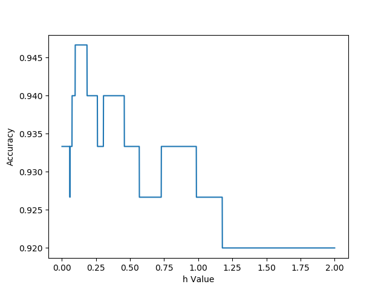
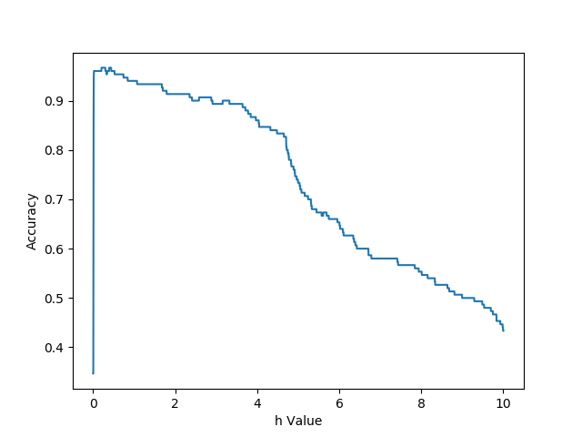
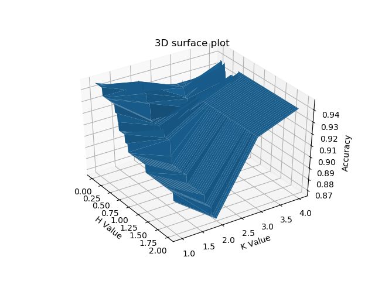

# INT304 Pattern Recognition Assignment 2
### Discriminant Functions & Non-parametric Classifiers

#### Utter_pulsar

----

> 这是模式识别课程当中针对```Parzen Window Method```和```Modified Quadratic Discriminant Function```等几个贝叶斯派别的算法理解的作业。

----
## 模型超参数正确率分布结果

- 当超参数```h value```或```k value```变化的时候，不同模型正确率分布结果如下所示：





----
## 项目文件解释

- ```./data/iris.data```是本作业的示例数据集。

- ```./Materials/INT304-Assessment 2-Assignment.pdf```是本次作业的题目要求。

- ```./Materials/INT304-Assessment 2-Report.pdf```是本次作业的针对作业要求作答的报告。

## 项目目录

- [INT304_Assignment_2]()
  - [data]()
    - [iris.data]()
  - [Materials]()
    - [Pictures]()
      - [G1]()
      - [G2]()
      - [Q1]()
    - [INT304-Assessment 2-Assignment.pdf]()
    - [INT304-Assessment 2-Report.pdf]()
  - [Question1.py]()
  - [Question2_G1.py]()
  - [Question2_G2.py]()
  - [Question2_QDF.py]()
  - [README.md]()


----
## 运行

- 本项目核心的算法不允许使用第三方库（除了KFold），所以希望从应用层面理解贝叶斯如何工作的人请放心食用。
- 直接运行其中的每个```.py```文件就好，配合```./Materials/INT304-Assessment 2-Report.pdf```可以更深入的理解。
